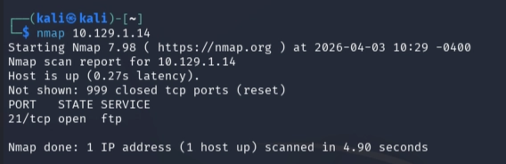
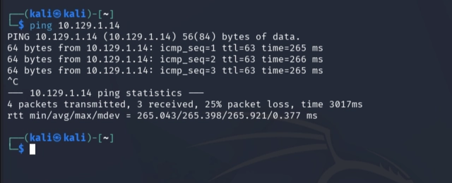
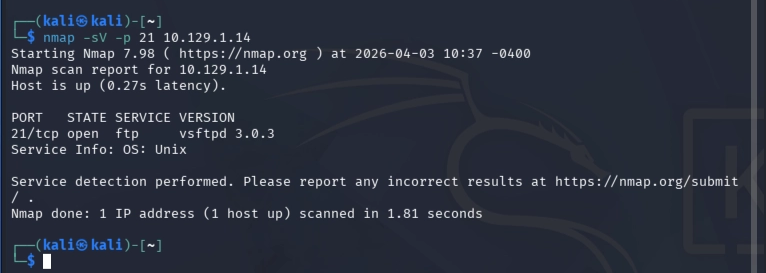
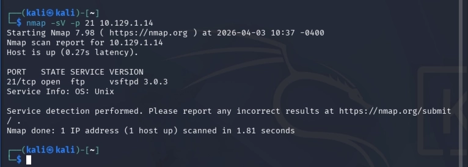
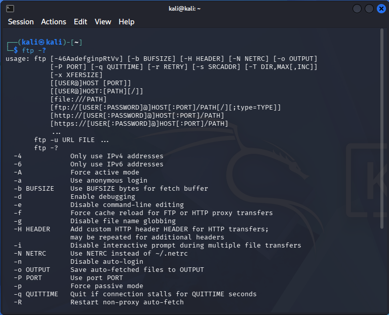
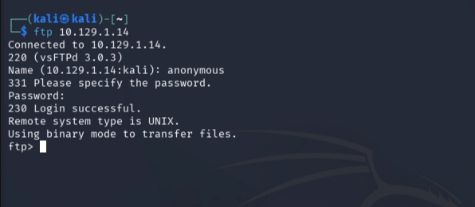
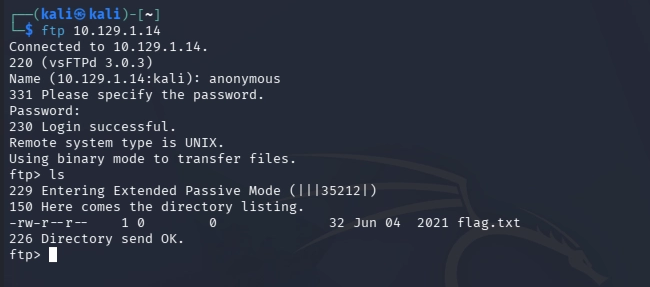
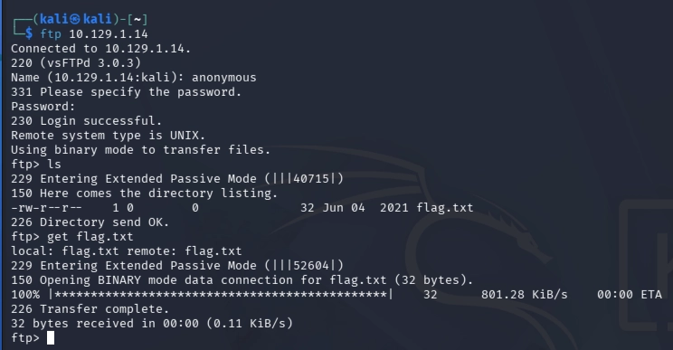

# Machine 2 — Fawn

### **About**

Fawn is a very easy Linux machine that explores the File Transfer Protocol (FTP) and how it can be exploited when misconfigured to allow anonymous access.

### Questions:

**What does the 3-letter acronym FTP stand for?**
**A:** File Transfer Protocol

**Which port does the FTP service listen on usually?**
**A:** 21

**FTP sends data in the clear, without any encryption. What acronym is used for a later protocol designed to provide similar functionality to FTP but securely, as an extension of the SSH protocol?**
**A:** SFTP — Secure File Fransfer Protocol

**What is the command we can use to send an ICMP echo request to test our connection to the target?
A:** ping

**From your scans, what version is FTP running on the target?
A:** vsFTPd 3.0.3

**From your scans, what OS type is running on the target?**
**A:** Unix

**What is the command we need to run in order to display the 'ftp' client help menu?**
**A:** ftp -?

**What is username that is used over FTP when you want to log in without having an account?**
**A:** anonymous

**What is the response code we get for the FTP message 'Login successful'?
A:** 230

**There are a couple of commands we can use to list the files and directories available on the FTP server. One is dir. What is the other that is a common way to list files on a Linux system.**
**A:** ls

**What is the command used to download the file we found on the FTP server?**
**A:** get

**Submit root flag**
**A:** 035db21c881520061c53e0536e44f815

