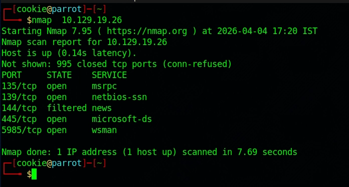
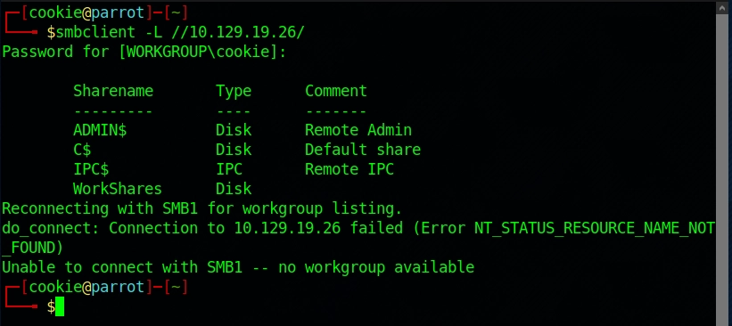
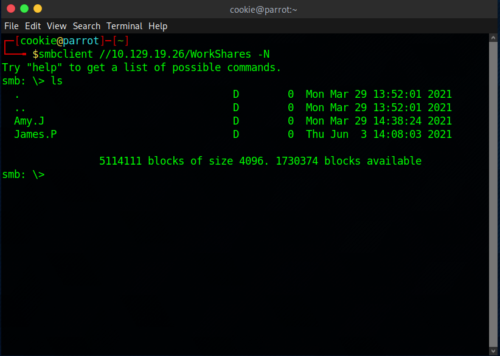
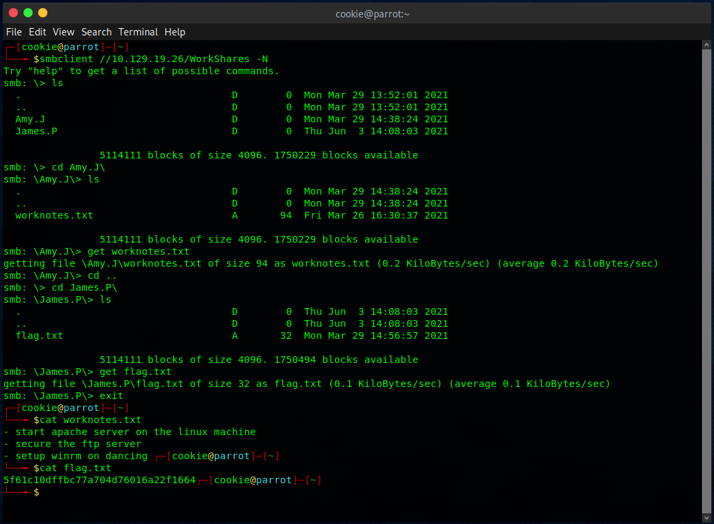

# Machine 3 — Dancing

### **About**

Dancing is a very easy Windows machine that introduces the Server Message Block (SMB) protocol, its enumeration, and how it can be exploited when misconfigured to allow access without a password.

### Questions:

**What does the 3-letter acronym SMB stand for?**
**A:** Server Message Block

**What port does SMB use to operate at?**
**A: 445**

**What is the service name for port 445 that came up in our Nmap scan?**
**A:** microsoft-ds

**What is the 'flag' or 'switch' that we can use with the smbclient utility to 'list' the available SMB shares on Dancing?**
**A:** -L

**How many shares are there on Dancing?**
**A:** 4

**What is the name of the share we are able to access in the end with a blank password?**
**A:** WorkShares

**What is the command we can use within the SMB shell to download the files we find?**
**A:** get

**Submit root flag**
**A:** 5f61c10dffbc77a704d76016a22f1664