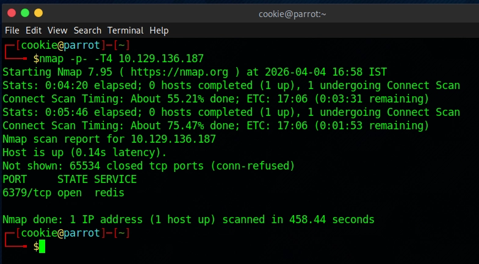
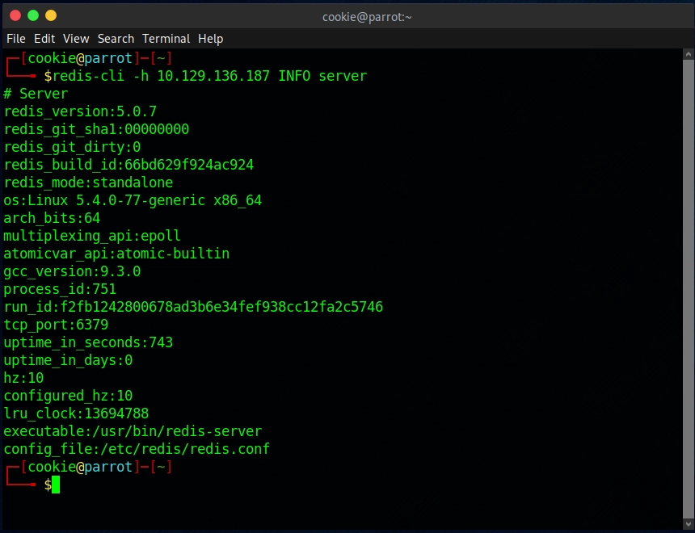
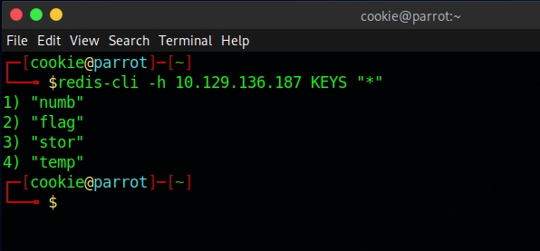
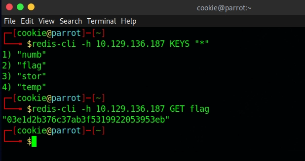

# Machine 4 — Redeemer

### **About**

Redeemer is a very easy Linux machine which explores the enumeration and exploitation of a Redis database server while showcasing the redis-cli command line utility and basic commands to interact with the Redis service.

### Questions:

**Which TCP port is open on the machine?**
**A:** 6379

**Which service is running on the port that is open on the machine?**
**A:** redis

**What type of database is Redis? Choose from the following options: (i) In-memory Database, (ii) Traditional Database
A:** In-memory Database

**Which command-line utility is used to interact with the Redis server? Enter the program name you would enter into the terminal without any arguments.**
**A:** redis-cli

**Which flag is used with the Redis command-line utility to specify the hostname?**
**A:** -h

**Once connected to a Redis server, which command is used to obtain the information and statistics about the Redis server?**
**A:** INFO

**What is the version of the Redis server being used on the target machine?**
**A:** 5.0.7

**Which command is used to select the desired database in Redis?**
**A:** select

**How many keys are present inside the database with index 0?**
**A: 4**

**Which command is used to obtain all the keys in a database?**
**A:** KEYS *

**Submit root flag**
**A:** 03e1d2b376c37ab3f5319922053953eb

