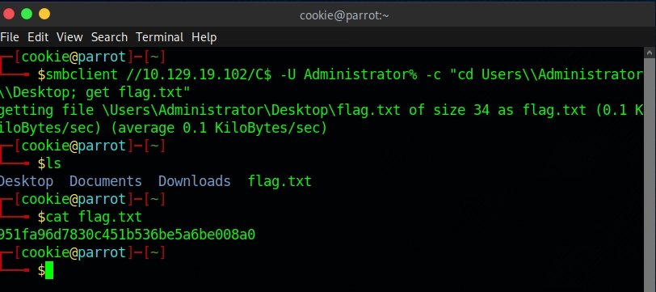

# Machine 5 — Explosion

### **About**

Explosion is a very easy Windows machine that showcases the Remote Desktop Protocol (RDP), how to interact with it using the xfreerdp client, and how improper configurations can allow unauthenticated access.

### Questions:

**What does the 3-letter acronym RDP stand for?**
**A:** Remote Desktop Protocol

**What is a 3-letter acronym that refers to interaction with the host through a command line interface?**
**A:** CLI

**What about graphical user interface interactions?**
**A:** GUI

**What is the name of an old remote access tool that came without encryption by default and listens on TCP port 23?**
**A:** Telnet

**What is the name of the service running on port 3389 TCP?**
**A:** ms-wbt-server

**What is the switch used to specify the target host's IP address when using xfreerdp?**
**A:** /v:

**What username successfully returns a desktop projection to us with a blank password?**
**A:** Administrator

**Submit root flag**
**A:** 951fa96d7830c451b536be5a6be008a0

> For some reason the xfreerdp wasn’t working
>