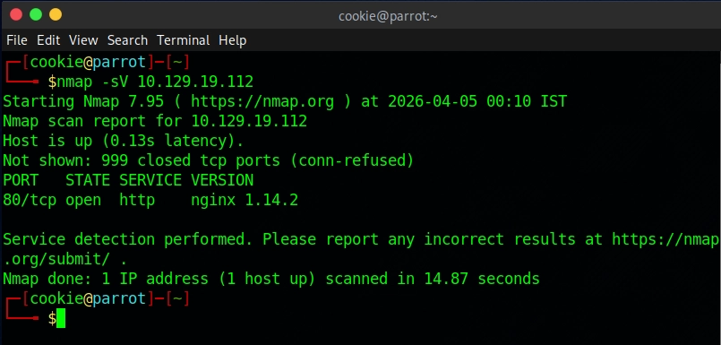
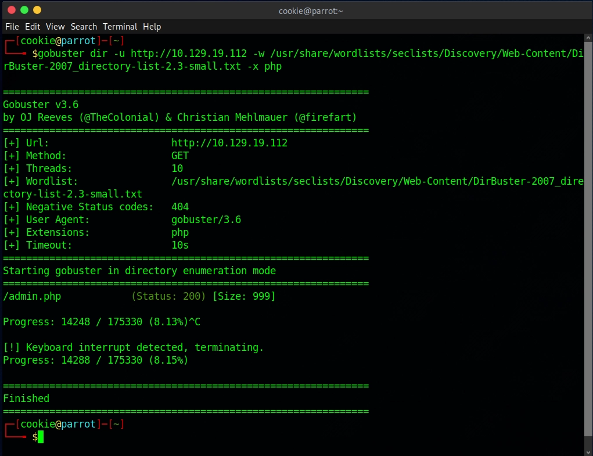
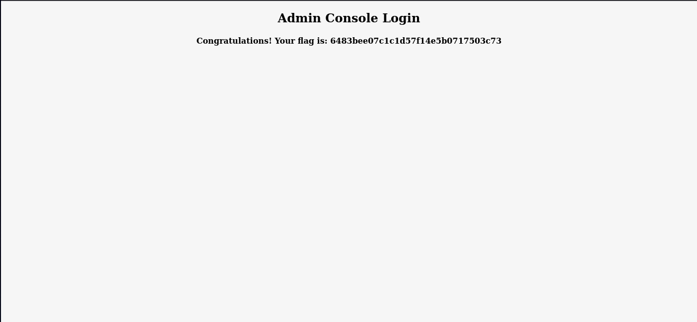

# Machine 6 — Preignition

### **About**

Preignition is a very easy Linux machine that introduces beginner web enumeration and directory fuzzing. After discovering a vulnerable admin login endpoint, the web app highlights the risks of improper configuration and default credentials.

### Questions:

**Directory Brute-forcing is a technique used to check a lot of paths on a web server to find hidden pages. Which is another name for this? (i) Local File Inclusion, (ii) dir busting, (iii) hash cracking.**
**A:** dir busting

**What switch do we use for nmap's scan to specify that we want to perform version detection?**
**A: -sV**

**What does Nmap report is the service identified as running on port 80/tcp?**
**A:** http

**What server name and version of service is running on port 80/tcp?**
**A:** nginx 1.14.2

**What switch do we use to specify to Gobuster we want to perform dir busting specifically?**
**A:** dir

**When using gobuster to dir bust, what switch do we add to make sure it finds PHP pages?**
**A:** -x php

**What is the HTTP status code reported by Gobuster for the discovered page?**
**A:** admin.php

**What is the HTTP status code reported by Gobuster for the discovered page?**
**A:** 200

**Submit root flag**
**A:** 6483bee07c1c1d57f14e5b0717503c73

> Use admin admin to get the flag

