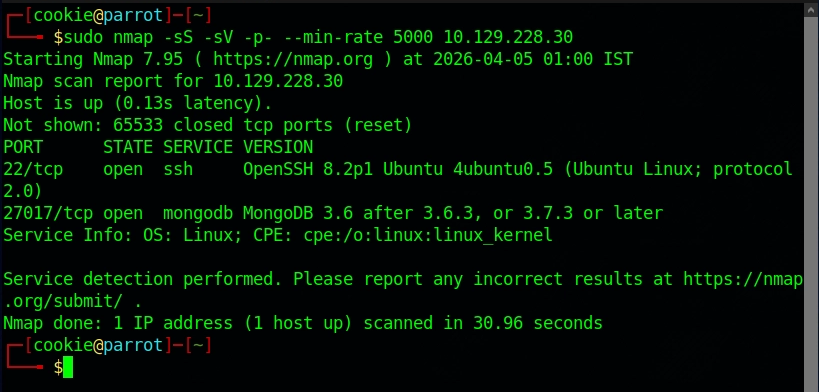
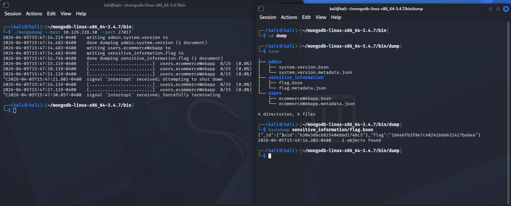

# Machine 7 — Mongod

## **About**

Mongod is a very easy Linux machine that introduces MongoDB and the MongoDB shell for interacting with it. A misconfiguration that leaves the anonymous user enabled allows exploitation and full enumeration of the database.

### Questions:

**How many TCP ports are open on the machine?**
**A:** 2

**Which service is running on port 27017 of the remote host?**
**A:** MongoDB 3.6.8

**What type of database is MongoDB? (Choose: SQL or NoSQL)**
**A:** NoSQL

**What command is used to launch the interactive MongoDB shell from the terminal?**
**A:** mongosh

**What is the command used for listing all the databases present on the MongoDB server? (No need to include a trailing ;)**
**A:** show dbs

**What is the command used for listing out the collections in a database? (No need to include a trailing ;)**
**A:** show collections

**What command is used to dump the content of all the documents within the collection named flag?**
**A:** db.flag.find()

**Submit root flag**
**A:** 1b6e6fb359e7c40241b6d431427ba6ea