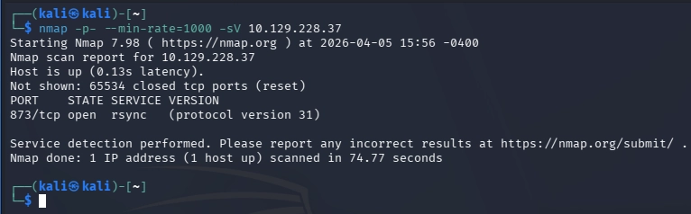
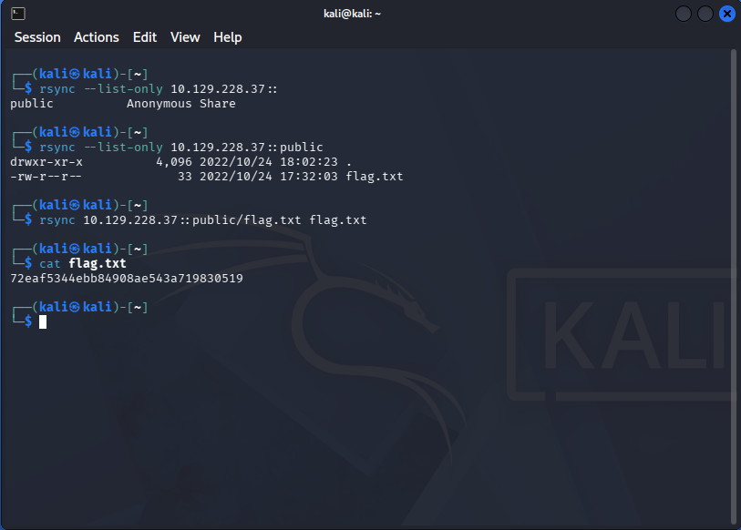

# Machine 8 — Synced

### **About**

Synced is a very easy Linux machine that explores the Rsync protocol, how to interact with it, and the risks of improper configuration that allows anonymous authentication.

### Questions:

**What is the default port for rsync?**
**A: 873**

**How many TCP ports are open on the remote host?**
**A: 1**

**What is the protocol version used by rsync on the remote machine?
A: 31**

**What is the most common command name on Linux to interact with rsync?
A:** rsync

**What credentials do you have to pass to rsync in order to use anonymous authentication? anonymous:anonymous, anonymous, None, rsync:rsync
A:** None

[https://www.notion.so](https://www.notion.so)

**What is the option to only list shares and files on rsync? (No need to include the leading -- characters)
A:** list-only

**Submit root flag
A:** 72eaf5344ebb84908ae543a719830519